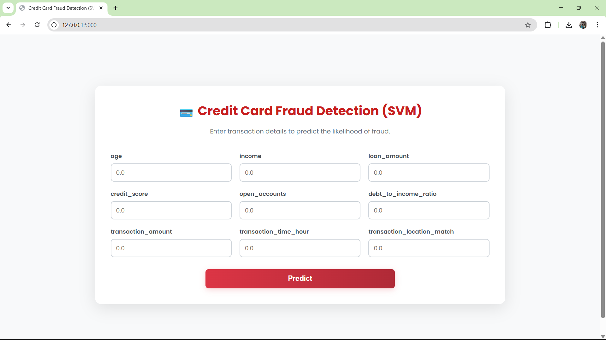
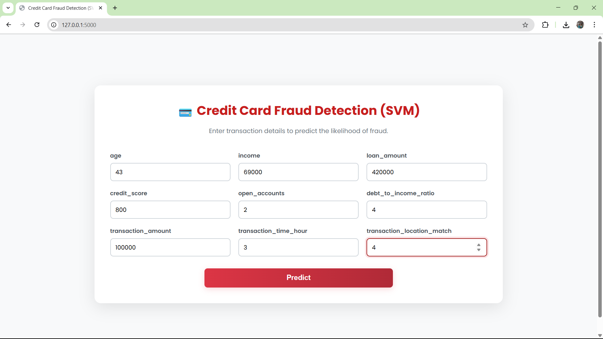
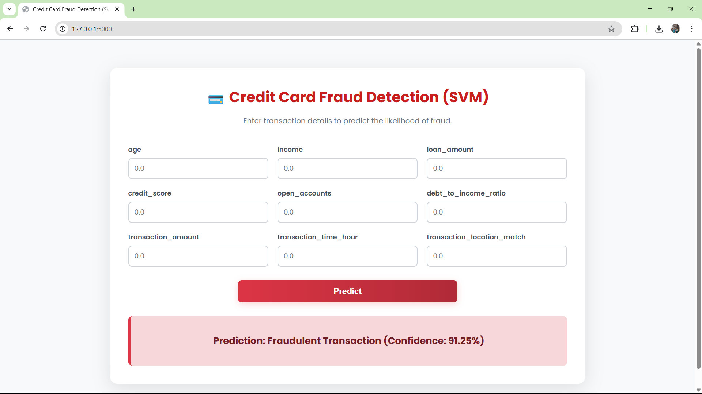

-----

# Credit Card Fraud Detection using SVM

This project develops a machine learning model to detect fraudulent credit card transactions using a **Support Vector Machine (SVM)** classifier. The model is deployed as a simple web application using Flask for real-time transaction verification. 

-----

## Overview

The primary goal is to build an effective classifier that can distinguish between legitimate and fraudulent credit card transactions. Given the nature of fraud, this project addresses the critical challenge of working with a **highly imbalanced dataset**.

The workflow includes:

1.  **Data Preprocessing**: Loading and cleaning the anonymous transaction data.
2.  **Handling Imbalance**: Analyzing the class imbalance and preparing the data for model training.
3.  **Model Training**: Building and training a Support Vector Machine (SVM), a powerful algorithm for classification tasks.
4.  **Model Deployment**: Saving the trained model with `pickle` and building a Flask web application to serve real-time predictions.

-----

## The Challenge: Imbalanced Data

Fraud detection datasets are notoriously imbalanced—the number of legitimate transactions is vastly greater than the number of fraudulent ones. If not handled correctly, a model might achieve high accuracy simply by always predicting "not fraud," making it useless in practice. This project's notebook explores this issue and uses techniques to build a more robust and fair model.

-----

## The Model: Support Vector Machine (SVM)

A **Support Vector Machine** is a supervised machine learning algorithm that is highly effective for classification problems. It works by finding an optimal **hyperplane** (a boundary) that best separates the data points of different classes in a high-dimensional space. For this project, the SVM learns to draw a boundary that separates the "fraudulent" transactions from the "genuine" ones based on the provided features.

-----

## File Structure

The repository contains the following files:

  * `Credit Fraud SVM App.ipynb`: The Jupyter Notebook with all the code for data exploration, preprocessing, model training, and evaluation.
  * `creditcard.csv`: The dataset containing anonymized transaction data, including the target `Class` column (0 for genuine, 1 for fraud).
  * `app.py`: The **Flask application** script that loads the trained SVM model and serves the user interface.
  * `credit_fraud_svm_app.pkl`: The saved, pre-trained SVM model file.
  * `requirements.txt`: A list of all required Python libraries.

-----

##  Project Structure
```
Credit_Fraud_SVM_App/
├── static/
│   └── css/                          # CSS styles for the Flask web interface
├── templates/                        # HTML templates for rendering the UI
├── README.md                         # Project documentation and usage guide
├── app.py                            # Main Flask application entry point
├── create_model.py                   # Script to train and serialize the SVM model
├── credit_fraud_data.csv             # Dataset used for credit card fraud detection
├── fraud_svm_model.pkl               # Saved SVM model for prediction
├── img1.png                          # App UI screenshot or workflow image
├── img2.png
├── img3.png
├── requirements.txt                  # Python dependencies for running the project
```

## How to Run the Project

Follow these steps to set up and run the application on your local machine.

### 1\. Get the Project Files

```bash
# Export the specific directory
svn export https://github.com/nadeem1615/Data-Science/trunk/Supervised/Credit_Fraud_SVM_App
# Navigate into new directory
cd Data-Science/Supervised/Credit_Fraud_SVM_App
```

### 2\. Create a Virtual Environment (Recommended)

Isolating project dependencies is always a good practice.

```bash
# For Windows
python -m venv venv
venv\Scripts\activate

# For macOS/Linux
python3 -m venv venv
source venv/bin/activate
```

### 3\. Install Dependencies

Install all the necessary libraries using the `requirements.txt` file.

```bash
pip install -r requirements.txt
```

### 4\. Run the Flask App

Start the local web server by running the `app.py` script.

```bash
python app.py
```

### 5\. Access the Application

Open your web browser and go to the following URL:
[http://127.0.0.1:5000](https://www.google.com/search?q=http://127.0.0.1:5000)

You can now use the web interface to get predictions from the model.

-----

## Disclaimer

This project is for educational and demonstrative purposes only. The model and application should not be used for real-world financial systems without extensive further testing, validation, and adherence to security best practices.


## Screenshots:

## Step 1:

## Step 2:

## Step 3:
