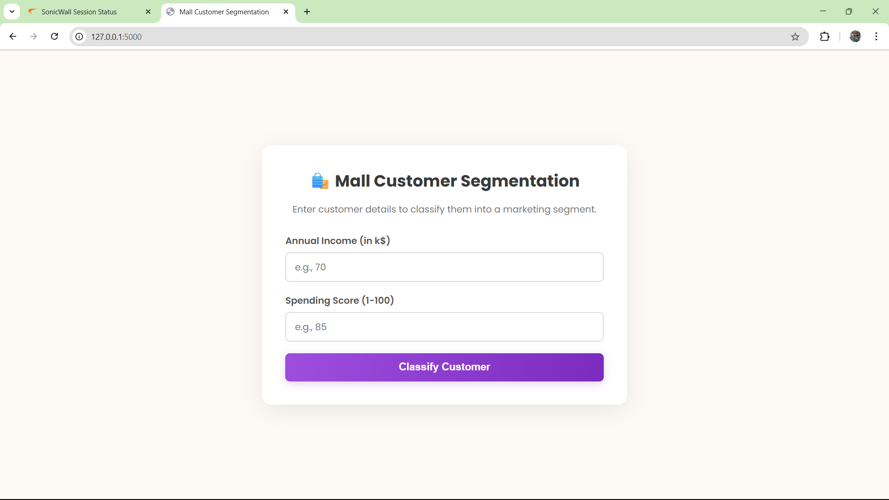
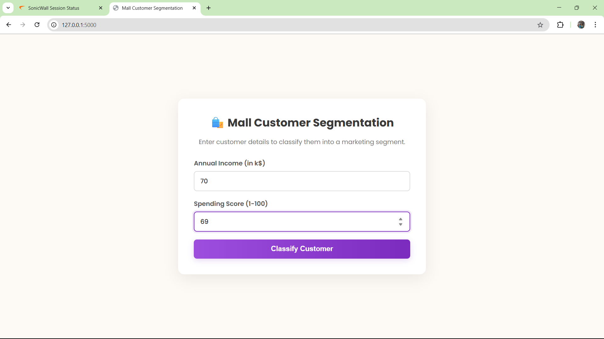
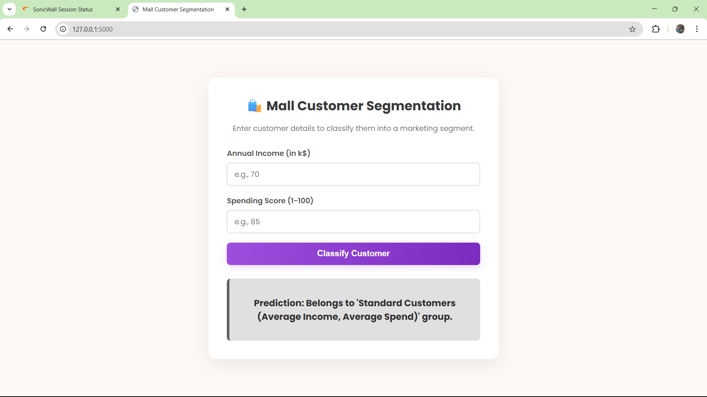

# Customer Segmentation using Hierarchical Clustering 

This project demonstrates how to segment customers into distinct groups using **Agglomerative Hierarchical Clustering**. By analyzing data from mall customers, specifically their annual income and spending score, we can identify different customer personas. This type of analysis is invaluable for businesses looking to personalize marketing efforts.

The entire process, from creating a dendrogram to determine the optimal number of clusters to visualizing the final segments, is documented in a Jupyter Notebook.

-----

##  Files Description

  * **`Hierarchical Clustering.ipynb`**: This is the core Jupyter Notebook for the project. It provides a step-by-step guide that covers:
      * Loading and preparing the customer dataset.
      * Generating and interpreting a **dendrogram** to find the most suitable number of clusters.
      * Applying the Agglomerative Hierarchical Clustering algorithm.
      * Visualizing the resulting customer segments on a scatter plot.
  * **`Mall_Customers.csv`**: The dataset used for the analysis, containing features like `Age`, `Annual Income (k$)`, and `Spending Score (1-100)`.

-----

##  Core Concept: Hierarchical Clustering & Dendrograms

**Hierarchical Clustering** is an algorithm that builds a hierarchy of clusters. The "bottom-up" or *agglomerative* approach works as follows:

1.  Initially, each data point is treated as its own cluster.
2.  The algorithm finds the two closest clusters and merges them.
3.  This process is repeated until only one single cluster, containing all the data points, remains.

The key tool used with this method is the **Dendrogram**, a tree-like diagram that visualizes the entire merging process. Its primary purpose is to help us decide on the optimal number of clusters. We do this by finding the longest vertical line on the dendrogram that doesn't intersect any of the horizontal "cluster" lines.

-----
## Project Structure

```
Hierarchical_Clustering_Mall_Customer_Segmentation/
│
├── static/                         # CSS styles for the Flask application
│   └── css/
├── templates/                     # HTML templates for the app interface
├── Mall_Customers.csv             # Dataset containing mall customer data
│
├── README.md                      # Project documentation and usage instructions
├── requirements.txt               # Python dependencies
│
├── app.py                        # Main Flask application entry point
├── create_classifier_model.py    # Script to train and save the hierarchical clustering model
│
├── customer_cluster_model.pkl    # Serialized hierarchical clustering model
│
├── img1.png                      # Screenshots or visuals of the app
├── img2.png
├── img3.png

```

##  How to Run the Project

Follow these instructions to run the analysis on your local machine.

#### 1\. Get the Project Files

First, download the project folder. You can use `svn` to quickly get just this specific folder from the repository.

```bash
# Export the specific project directory
svn export https://github.com/SURESH6161/Data-Science/trunk/Unsupervised/Hierarchical_Clustering_Mall_Customer_Segmentation

# Navigate into the new directory
cd Hierarchical_Clustering_Mall_Customer_Segmentation
```

*(Alternatively, you can download the entire repository as a ZIP file from GitHub and navigate to this folder).*

#### 2\. Create a Virtual Environment

It's a best practice to use a virtual environment to manage your project's dependencies cleanly.

```bash
# Create the environment
python -m venv venv

# Activate it
# On Windows:
venv\Scripts\activate

# On macOS/Linux:
source venv/bin/activate
```

#### 3\. Install Dependencies

Create a file named `requirements.txt` in the project directory with the following content. Note the inclusion of `scipy`, which is used to create the dendrogram.

**`requirements.txt`**:

```
scikit-learn
pandas
numpy
matplotlib
seaborn
scipy
notebook
```

Now, install all the required libraries with a single command:

```bash
pip install -r requirements.txt
```

#### 4\. Launch Jupyter Notebook

With the setup complete, start the Jupyter server from your terminal.

```bash
jupyter notebook
```

#### 5\. Run the Analysis

In the browser tab that opens, click on **`Hierarchical Clustering.ipynb`**. You can now execute the code cells in order to perform the data analysis, generate the dendrogram, and visualize the final customer segments.

-----

##  Screenshots:

## Step 1:

## Step 2:

## Step 3:

-----

##  Disclaimer

This project is an educational demonstration of Hierarchical Clustering. The customer segments identified are based on the provided dataset and the specific parameters chosen for the analysis.