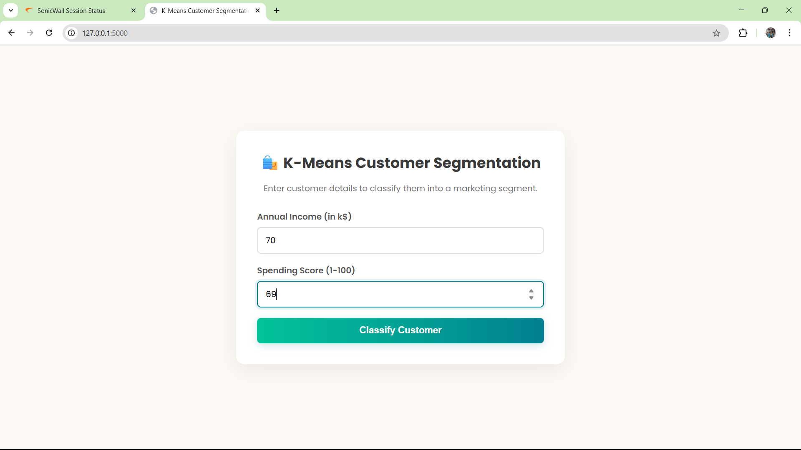

# Customer Segmentation using K-Means Clustering 

This project segments mall customers into distinct groups using the **K-Means Clustering** algorithm, one of the most popular and fundamental methods in unsupervised learning. The analysis focuses on identifying customer personas based on their annual income and spending score, providing actionable insights for targeted marketing.

A key part of the analysis involves using the **Elbow Method** to determine the optimal number of clusters for the dataset. The entire workflow is presented in a Jupyter Notebook.

-----

##  Files Description

  * **`Mall Customer Segmentation.ipynb`**: This is the project's core Jupyter Notebook. It provides a complete walkthrough of the K-Means clustering process, including:
      * Loading and inspecting the customer data.
      * Using the Elbow Method to find the optimal number of clusters ('k').
      * Training the K-Means model with the chosen value of 'k'.
      * Visualizing the final customer segments.
  * **`Mall_Customers.csv`**: The dataset used for the analysis, which contains customer information like `Age`, `Annual Income (k$)`, and `Spending Score (1-100)`.

-----

##  Core Concept: K-Means & The Elbow Method

**K-Means Clustering** is an algorithm that aims to partition data into 'k' distinct, non-overlapping clusters. It works by assigning each data point to the cluster with the nearest mean (called the cluster *centroid*), then recalculating the centroid of each cluster. This process repeats until the clusters are stable.

To find the best value for 'k', we use the **Elbow Method**. This involves running the K-Means algorithm for a range of different 'k' values and calculating the Within-Cluster Sum of Squares (WCSS) for each. When we plot the WCSS against 'k', the graph often looks like an arm. The "elbow" on the arm—the point where the rate of WCSS decrease sharply slows down—is considered the optimal number of clusters.

-----


## Project Structure 
```
Mall_Customer_KMeans/
│
├── static/                         # CSS styles for the Flask application
│   └── css/
├── templates/                     # HTML templates for the app interface
├── Mall_Customers.csv             # Dataset containing mall customer data
│
├── README.md                      # Project documentation and usage instructions
├── requirements.txt               # Python dependencies
│
├── app.py                        # Main Flask application entry point
├── create_model.py               # Script to train and save the K-Means clustering model
│
├── kmeans_model.pkl              # Serialized K-Means clustering model
│
├── img1.png                      # Screenshots or visuals of the app
├── img2.png
├── img3.png
```

##  How to Run the Project

Follow these steps to replicate the analysis on your machine.

#### 1\. Get the Project Files

First, you need to download the project folder. You can use `svn` to get just this specific folder.

```bash
# Export the specific project directory
svn export https://github.com/nadeem1615/Data-Science/trunk/Unsupervised/Mall_Customer_KMeans

# Navigate into the new directory
cd Mall_Customer_KMeans
```

*(Alternatively, download the entire repository as a ZIP from GitHub and navigate to this folder).*

#### 2\. Create a Virtual Environment

It's a good practice to use a virtual environment to manage your project's dependencies.

```bash
# Create the environment
python -m venv venv

# Activate it
# On Windows:
venv\Scripts\activate

# On macOS/Linux:
source venv/bin/activate
```

#### 3\. Install Dependencies

Create a file named `requirements.txt` in the project directory with the following content:

**`requirements.txt`**:

```
scikit-learn
pandas
numpy
matplotlib
seaborn
notebook
```

Now, install all the libraries with a single command:

```bash
pip install -r requirements.txt
```

#### 4\. Launch Jupyter Notebook

With everything set up, start the Jupyter server from your terminal.

```bash
jupyter notebook
```

#### 5\. Run the Analysis

In the browser tab that opens, click on **`Mall Customer Segmentation.ipynb`**. You can then run the code cells in order to perform the Elbow Method analysis and visualize the final customer segments.

-----

##  Screenshots:

### Step 1:

### Step 2:

### Step 3:


-----

##  Disclaimer

This project is an educational demonstration of the K-Means algorithm. The insights and customer segments are derived solely from the provided dataset and should be considered as a practical example of a clustering task.